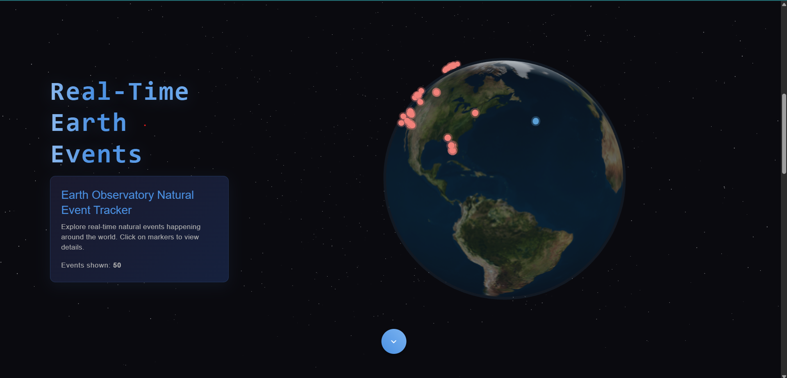
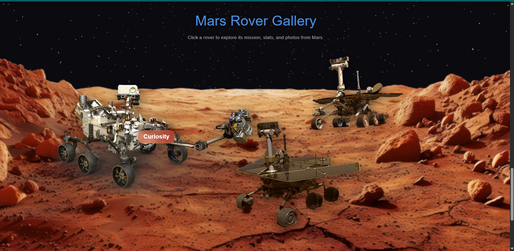
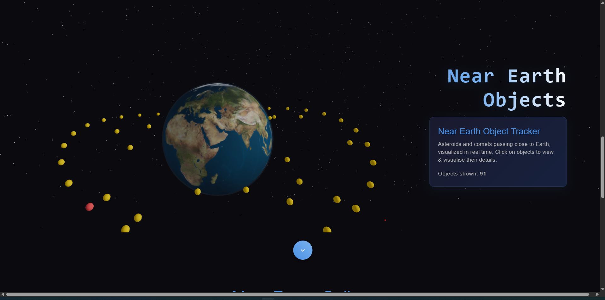
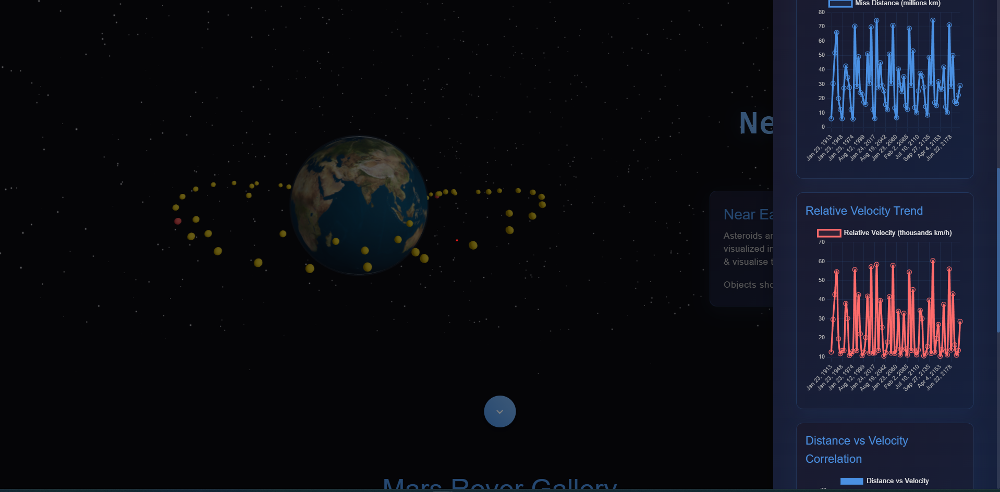
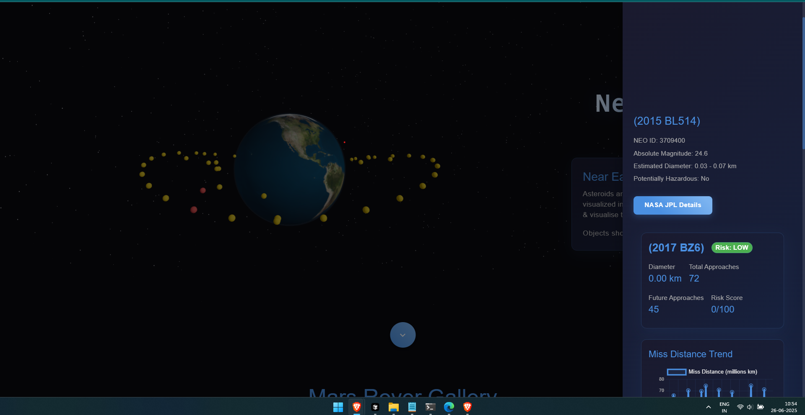
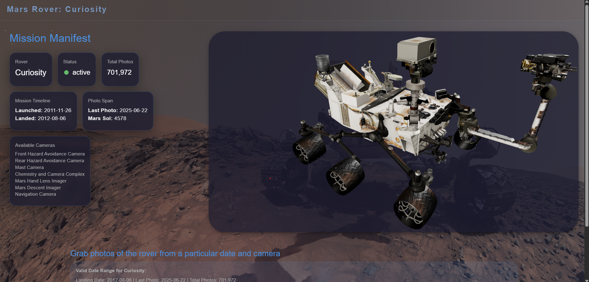

# NASA Explorer

A creative web application that provides interactive access to various NASA APIs, featuring 3D visualizations, real-time data, and mobile-friendly design.

## Application Screenshots

### 3D Earth with Earth events 


### Mars Rover Gallery


### NEO Details and Charts





### Curiosity Rover 3D Model and Manifest


## Features

### Interactive 3D Earth Visualization
- Rotatable 3D Earth model 
- Interactive markers displaying real-time data from NASA's Earth Observatory Natural Event Tracker (EONET)
- Near Earth Object Web Service (NeoWs) data visualization with detailed information cards and visualization
- Click on markers to view comprehensive details about natural events and near-earth objects

### Mars Rover Exploration
- Mars Rover Selector with three available rovers: Curiosity, Opportunity, and Spirit
- Detailed rover information pages with mission manifests and descriptive cards
- Interactive 3D rover models for each mission
- Photo gallery with filtering capabilities by camera type
- Real-time photo fetching from NASA's Mars Rover Photo API

### Astronomy Picture of the Day (APOD)
- Daily featured astronomical images from NASA
- High-resolution images with detailed descriptions

### Mobile-Friendly Design
- Responsive layout that works seamlessly on desktop, tablet, and mobile devices
- Touch-friendly interactions for 3D models and navigation
- Optimized performance across all screen sizes

## Known Issues


### Mars Rover Photo API Limitations
- Currently only fetching photos for the Curiosity rover
- Attempts to fetch photos for Spirit and Opportunity rovers result in redirects
- This is a known issue on NASA's API side, not a problem with the application


## Prerequisites

- Node.js (version 17 or higher)
- npm 

## Installation

### Backend Setup

1. Navigate to the backend directory:
   ```bash
   cd backend
   ```

2. Install dependencies:
   ```bash
   npm install
   ```

3. Start the backend server:
   ```bash
   npm run dev
   ```


### Frontend Setup

1. Open a new terminal and navigate to the frontend directory:
   ```bash
   cd frontend
   ```

2. Install dependencies:
   ```bash
   npm install
   ```

3. Start the development server:
   ```bash
   npm run dev
   ```


## Usage

1. Open your browser and navigate to `http://localhost:5173`(if using locally) or live at `https://nasaexploreredeveshnarkhede.netlify.app/`
2. The application will load with the main Earth page featuring the 3D Earth visualization
3. Use your mouse to rotate and zoom the 3D Earth model
4. Click on markers to view detailed information about natural events and near-earth objects
5. Navigate to the Mars Rover Gallery section to explore rover missions
6. Select a rover to view detailed information, 3D models, and photo galleries by selecting the date and camera filter
7. Use the Astronomy Picture of the Day section to view daily NASA images

## API Endpoints

The backend provides the following API endpoints:

- `GET /api/apod` - Astronomy Picture of the Day
- `GET /api/eonet` - Earth Observatory Natural Event Tracker
- `GET /api/neo` - Near Earth Objects
- `GET /api/mars-rover/rovers` - Mars Rover information
- `GET /api/mars-rover/photos/:rover` - Mars Rover photos

## Testing

### Overview
The project includes comprehensive test suites for both frontend and backend components. Tests are written using Jest and React Testing Library for frontend components, and Jest for backend API endpoints.

### Backend Testing

#### Running Backend Tests
```bash
cd backend
npm test
```


#### Backend Test Files
- `src/apis/apod.test.ts` - Astronomy Picture of the Day API tests
- `src/apis/apod.handler.test.ts` - APOD handler function tests
- `src/apis/eonet.test.ts` - Earth Observatory Natural Event Tracker tests
- `src/apis/neo.test.ts` - Near Earth Objects API tests
- `src/apis/mars_rover.test.ts` - Mars Rover API tests
- `src/apis/mars_rover.handler.test.ts` - Mars Rover handler tests
- `src/apis/mars_rover.api.test.ts` - Mars Rover API integration tests

### Frontend Testing

#### Running Frontend Tests
```bash
cd frontend
npm test
```


#### Frontend Test Files
- `src/pages/EarthPage.test.tsx` - Main Earth page component tests
- `src/pages/MarsRoverDetailPage.test.tsx` - Mars Rover detail page tests


### Running All Tests

#### Option 1: Run Backend and Frontend Tests Separately
```bash
# Backend tests
cd backend && npm test

# Frontend tests (in a new terminal)
cd frontend && npm test
```


## Technologies Used

### Backend
- Node.js
- Express.js
- React + TypeScript
- Jest, React Testing Library (testing)

### Frontend
- React 19
- TypeScript
- Vite
- Material-UI
- React Three Fiber (3D graphics)
- React Router DOM
- Axios
- Jest & React Testing Library

## Development

### Available Scripts

#### Backend
- `npm run dev` - Start development server
- `npm test` - Run tests
- `npm run build` - Build for production

#### Frontend
- `npm run dev` - Start development server
- `npm run build` - Build for production
- `npm test` - Run tests
- `npm run lint` - Run ESLint


## License

This project is open source and available under the MIT License.
